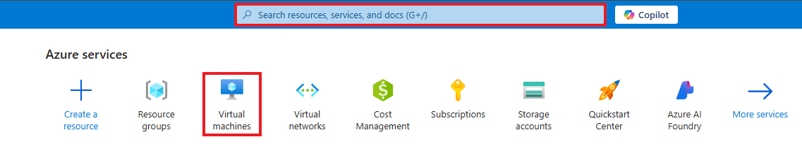
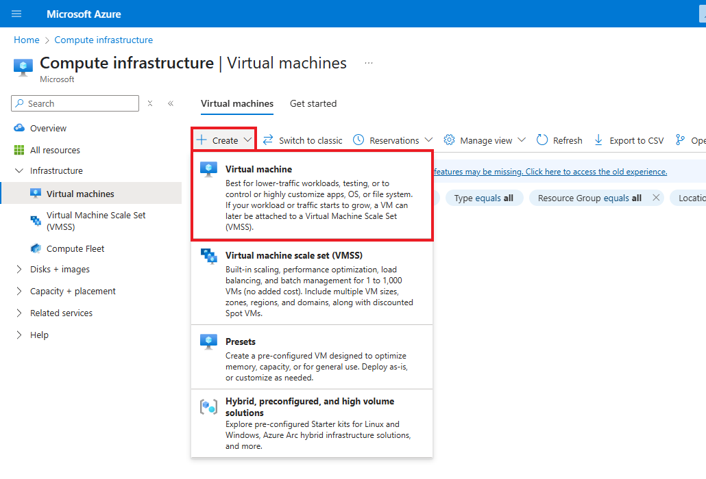
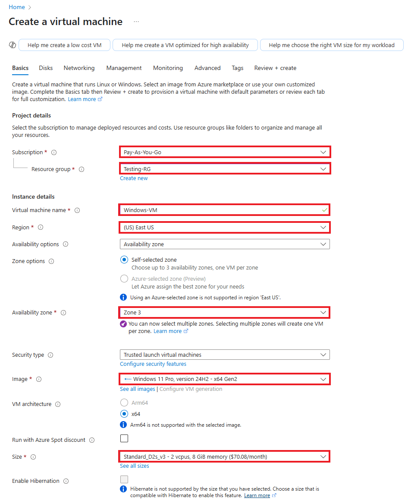
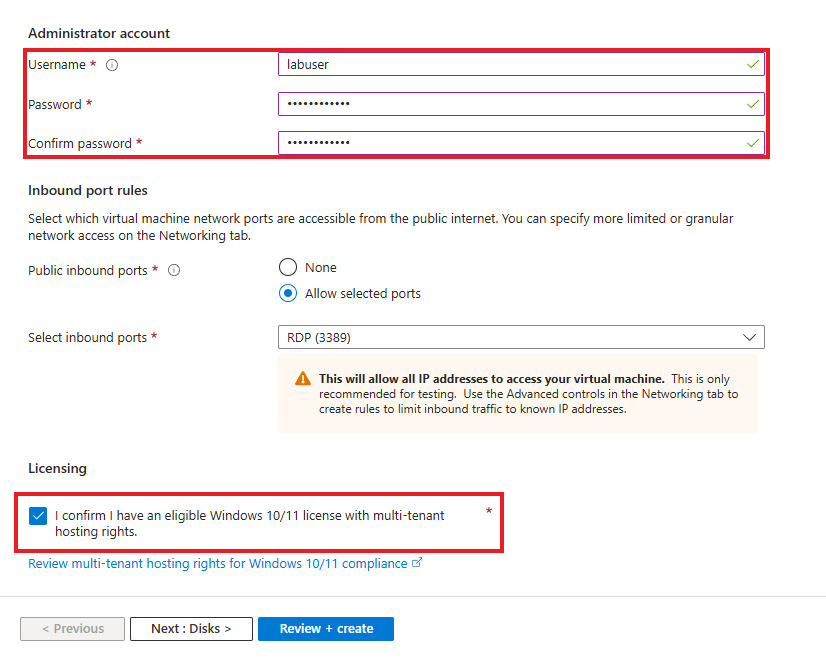
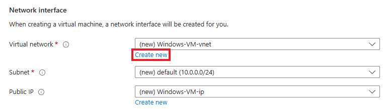
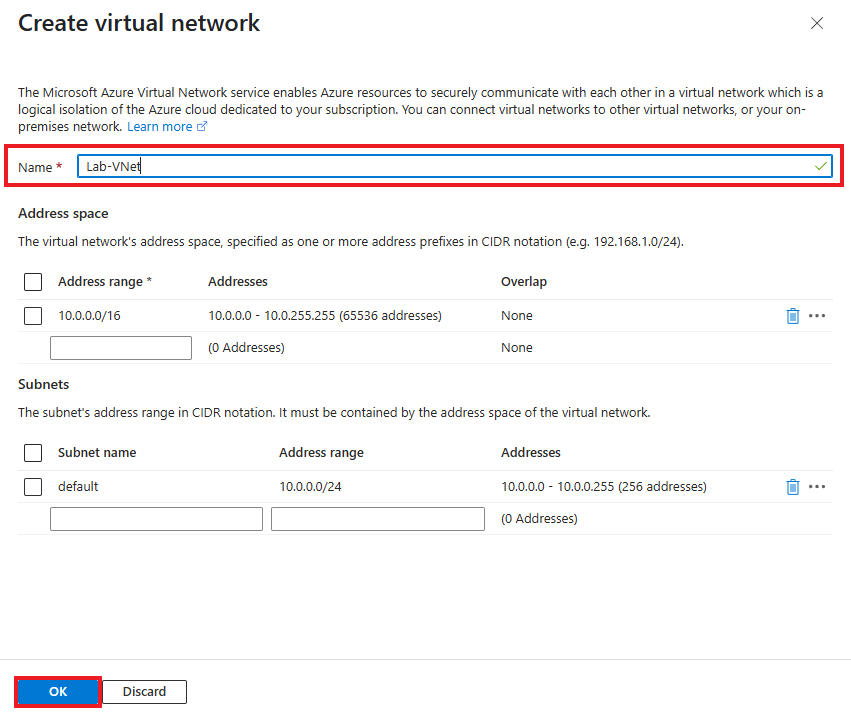
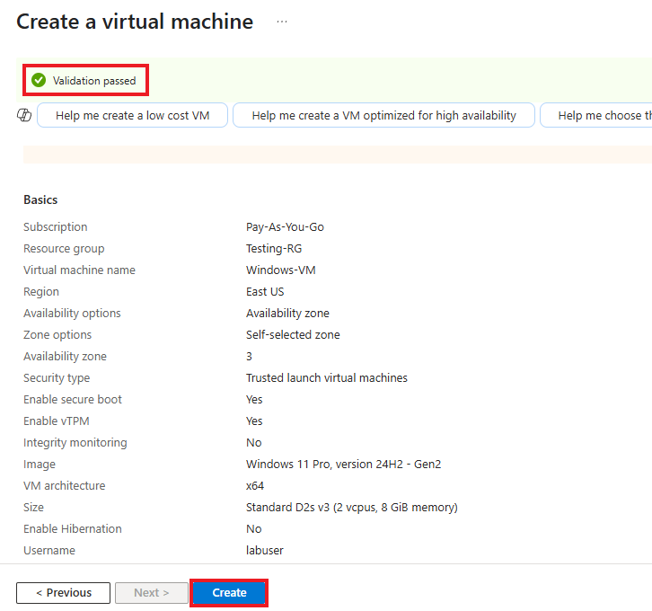

# osTicket - Prerequisites and Installation
This tutorial outlines the prerequisites aand installation of the help desk ticketing system: osTicket.

## Prerequisites Needed
- Microsoft Azure Subscription (Free/Pay as you go)
  
## Environments Used
- Microsoft Azure (Cloud Environment)
- Windows 11 Pro (Virtual Machine OS)

## Technologies Used
- Azure Virtual Machine
- osTicket (Help Desk Ticketing System)

## Installation Steps

*NOTE: Ensure that you are logged into your Microsoft Azure account, have a subscription active and have already made a resource group for your virtual machine.*

---

### Step 1: Create a new Virtual Machine within Microsoft Azure

1.1 Search for "Virtual Machine" in the search bar, or navigate to the Virtual Machine section back on the home page.

1.2 On the Virtual Machine page, click **Create**, and then select **Virtual machine**.

1.3 Fill out the following information:
- Subscription - Select your current and active subscription
- Resource Group - Select your resource group
- Virtual machine name - For this lab, we will name our VM:  **"Windows-VM"**
- Region - Select your current region. For this lab, we will select **"(US) East US"**
- Availablity Zone - Select **"Zone 3"**
- Image - Select **"Windows 11 Pro, version 24H2 - x64 Gen2"**
- Size - Select **"Standard_D2s_v3 - 2vcpus, 8GiB memory ($70.08/month)"**

Create your **Administrator account**.

- For this lab, we will use **labuser** as the username and **Cyberlab123!** as the password.

Check off the Licensing check box

Click **Next: Disks>**, and then **Next: Networking >**

1.4 Click **Create new** under Virtual Network. A window to create a virtual network should pop up

Create your **Virtual Network**

- For this lab, we will use **Lab-VNet** as the name of our virtual network

Click **OK** to proceed

Back on the Virtual Machine page, Click **Review + Create** to proceed  

1.5 Confirm that **Validation passed** for your virtual machine.

Review the the information you inputted, ensuring everything is correct.

Click **Create** once more to initialize deployment of your virtual machine.

**A Windows 11 Virtual Machine has now successfully been created.**
